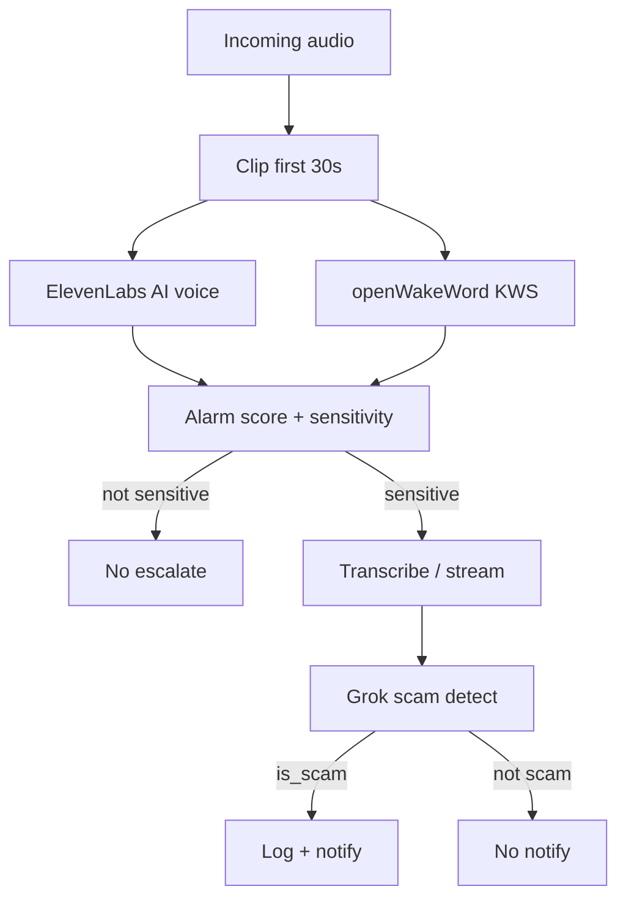

# Product / pipeline decisions

Living log of locked choices for HopHacks 2026 (We Hate Scammers). Update when we change direction.

---

## 2026-09-19 — SMS warnings via Textbelt

| Decision | Choice |
| --- | --- |
| SMS provider | **Textbelt** (not Twilio) |
| Why | Twilio trial cannot send custom Body (error 572006). Textbelt sends our warning copy. |
| Free quota | `TEXTBELT_KEY=textbelt` → **1 SMS/day**. High-tier repeats skipped on that key. |
| Dry-run | Missing key → build copy, do not send. |

---

## 2026-09-19 — Mid-call pipeline (screening → escalate → scam verdict)

### Stage A — Cheap screen (no full transcript)

| Decision | Choice |
| --- | --- |
| Opening window | **First 30 seconds** of incoming audio (`CLIP_SECONDS=30`; was 12 — raised to cut ElevenLabs FNs). Env override still works. |
| AI / not AI | **ElevenLabs** on the clip → `elevenlabs_ai_score` + `ai_voice_used` |
| Keywords | **openWakeWord** (open source KWS) on the same clip — **no** full-call STT |
| Combine | AI-voice signal **and** keyword hits together raise an **alarm score** (quantified) |
| Sensitivity | Map alarm score → **sensitivity tier** (e.g. not sensitive / low / medium / high) |

**Not used for voice truth:** Grok transcript `ai_generated` (text-only). Weak hint only if present.

### Stage B — Escalate only when flagged

| Decision | Choice |
| --- | --- |
| Gate | Only if sensitivity is above the “not sensitive” floor (exact thresholds TBD at implement) |
| Next | **Transcribe** (and **stream** partials as available) the audio |
| Verdict | Stream / send transcript to **Grok** scam classifier (existing `detect_scam` / detector path) |

### Stage C — Act on scam

| Decision | Choice |
| --- | --- |
| If scam | **Log** (upsert scam pattern / incident path) **and notify** (Textbelt via warnings) |
| If not scam | No notify; optional soft log / metrics only |

### End-to-end sequence

```
incoming audio
  → clip first 30s
  → ElevenLabs (AI voice) + openWakeWord (keyword hits)   [parallel]
  → alarm_score + sensitivity tier
  → if sensitive enough:
        transcribe / stream STT
        → Grok scam detect
        → if is_scam: log + notify
```



### Still deferred / TBD at implement

- Exact alarm formula (weights for `elevenlabs_ai_score` vs keyword hit weights)
- Exact sensitivity thresholds and tier names
- Live carrier/RTP ingest (demo uses laptop device — see below)
- Whether STT after escalate is clip-only, rolling window, or longer buffer

### Demo audio input

| Decision | Choice |
| --- | --- |
| Capture | **Laptop audio device** (mic / loopback) on the **local Mac** |
| Processing | **Linux backend** — Mac sends audio packets/chunks (HTTP or stream); does **not** run openWakeWord locally |
| Why | openWakeWord / onnxruntime wheels are unreliable on macOS 12; Linux install works |

### Keyword spotter library

| Decision | Choice |
| --- | --- |
| Library | **openWakeWord** (open source) |
| Runtime | **Linux only** for the hackathon demo |
| Why | OSS; custom wake words; fits “no full STT” screen |

---

## Earlier same-day notes (superseded detail folded above)

- Clip + ElevenLabs + KWS without full STT for the cheap screen
- Escalate to STT + Grok only when sensitivity warrants it
- Scam → log + notify
