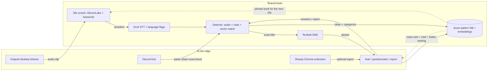

# Your Nigerian Prince Is Not Real

**Stop the scam before it starts.**

[yourprinceisnotreal.work](https://yourprinceisnotreal.work) · HopHacks 2026

Scams have outgrown the “suspicious website” checker. Callers harvest the voices of your loved ones and feed them into AI models to sound like your family. Robocalls are getting sneakier and more frequent. Scripts impersonate banks, the IRS, or a grandson in trouble. SMS providers miss the conversation itself. After that victim picks up the phone, they are at the whim of the scammer.

Enough of tools that tell you what already happened to someone else. It's time to fight AI with AI.

**YPINR** is a living defense: catch and kill the scam while the interaction is still early, then document their methods to help the next thousand people after.

We are not replacing carrier blocking or OS call screening. We do not claim zero false positives. But we hate scammers. And we bet you do too.

---

## The goal

Catch it while it is happening. Not a report you file after the money is gone.

We built a multifaceted system for different scam surfaces:

| Surface | Product | Job |
| --- | --- | --- |
| Phone / live audio | **Outpost** | Ethical listener. Screens the opening of a call and tips off the detector before the scammer gets anywhere. |
| Social media / DMs | **Sherpa** | Local Chrome extension. Highlights risky sentences and links on the page. |
| After the fact / public good | **the hub** | [yourprinceisnotreal.work](https://yourprinceisnotreal.work) — questionnaire, intel encyclopedia, news, and a “this happened to me” path into the corpus. |

Everything connects so the platform evolves as scammers do.

**Who it is for**

1. Someone on a suspicious call or text who needs a warning *now*.
2. Someone reading a DM who needs the dangerous line pointed out *in place*.
3. Someone unsure after the fact who wants a walkthrough.
4. Anyone who wants to look up how a scam type works — or share one so the next person does not have to.

---

## The pieces

### Outpost — phone scams

Outpost is a desktop sidecar (`desktop/`) that listens ethically. One click starts a capture loop. Clips go to the detector; the window shows the latest verdict, not a surveillance log.

- Victims are informed that a call is being evaluated. They choose whether to share scam data with us.
- Audio is processed for signal, not stored for later use. What leaves the device is a pattern match, not a recording.
- If the opening of the conversation looks like a scam, an AI agent is already scoring it — and an SMS can fire before the ask lands.

Outpost is the listener. It is not the website and it does not run the models. Capture stays on the laptop; scoring runs on the Linux detector.

Details: [`desktop/README.md`](desktop/README.md)

### Sherpa — social media scams

Sherpa is a Chrome extension that runs **entirely on-device**. No account. No upload. No telemetry. Your messages never leave the machine.

It uses weighted cue matching, association edges, and family combos (urgency + payment, authority + credentials, secrecy + money) to decide if a sentence smells like a scam. Then it highlights the span in place and explains why.

| Band | Score | What you see |
| --- | --- | --- |
| ok | 0–24 | nothing — normal chat stays untouched |
| caution | 25–54 | yellow · **SUSPICIOUS** |
| high | 55–100 | red · **SCAM LIKELY: AVOID LINKS** |

Watched surfaces: Discord, Instagram (including DMs), Reddit, and Google Drive comments. Users can report a flagged scam to the hub so the public corpus learns the method — not the person.

Details: [`clients/discord-highlighter/README.md`](clients/discord-highlighter/README.md) · scorer: [`scam-smell/`](clients/discord-highlighter/scam-smell/README.md)

### The hub — yourprinceisnotreal.work

The website is the destination every warning points to. React + Vite.

| Route | What it does |
| --- | --- |
| `/` | “Got scammed?” — six questions, a live verdict, plus a news wire of recent patterns |
| `/questionnaire` → `/results` | Adaptive check. Rules + embeddings + the scam database rank likely types and say why. |
| `/scams` · `/scams/:id` | Public intel: how a scam unfolds, who it targets, what to do |
| `/sherpa` | What the extension watches for, and why it never leaves the device |
| `/our-goal` | Privacy, live detection, and a **This is what happened to me** report |

If you are feeling charitable, share the *method* — gift cards, IRS refund, romance urgency. No names, account numbers, or codes. Personal data is never stored.

Details: [`frontend/`](frontend/)

### Detector, corpus, and warnings

The Linux backend (`backend/detector`) is the shared brain.

- **Screen** the first ~30 seconds cheaply: ElevenLabs AI-voice score + keyword / wake-phrase hits → alarm + sensitivity.
- **Escalate** only when the clip is sensitive enough: Grok transcription + language analysis.
- **Combine** audio score, urgency / money / impersonation flags, and vector match against known patterns.
- **Act**: Textbelt SMS by severity (always linking to the site). If it is scam-like, Grok cleans + categorizes and we upsert a scam record + embedding. Raw audio and raw transcripts are not kept.

Postgres holds **pattern types**, not people (`backend/db`). Seeded from public reports (~96 types and growing). Same `name` bumps `frequency`.

A Discord bot (`backend/discord_bot`) reuses `POST /v1/analyze` for pasted DMs. It does not SMS and does not store usernames.

---

## How they integrate



The loop is the product:

1. **Outpost** (or a pasted transcript) feeds the detector.
2. A warning, when it fires, always sends the person to **the hub** with a specific reason.
3. The hub ranks what they described against the corpus, and lets them teach it.
4. Grok strips PII, categorizes, embeds, and upserts.
5. The news wire, intel pages, questionnaire ranking, and the next Outpost screen all get sharper.

Sherpa stays local on purpose. It does not need the detector to flag a line. When a user *chooses* to report, that report joins the same corpus Outpost and the questionnaire already write to.

---

## How detection works

```
Call / text
    → clip first ~30s
    → ElevenLabs AI-voice score on audio
      + keyword / wake-phrase hits          (cheap screen, in parallel)
    → alarm score + sensitivity tier
    → if sensitive enough:
          Grok transcription + language analysis
          Detector (audio + urgency / money / impersonation flags + vector match)
          Textbelt SMS by severity, always linking to the site
          If scam-like: Grok cleans + categorizes → upsert scam record + embedding
```

**Signals we combine:** unknown caller, cash / money / “too good” offers, romance, urgency and pressure, rule flags, close match to a known cluster (e.g. “IRS refund”), and **AI-generated audio**.

Default combined score after escalate: `0.4 * elevenlabs_ai_score + 0.6 * grok.confidence` (renormalized if one side is missing).

| Combined score | `notification_tier` |
| --- | ---: |
| ≥ 0.70 | high |
| ≥ 0.40 | medium |
| else | low |

### Warning tiers (Textbelt)

| Confidence | Behavior |
| --- | --- |
| Low | Optional soft SMS |
| Medium | Clear warning + site link |
| High | Repeated texts; all copy points to the website |

Every warning states that a potential scam was flagged, gives a **specific reason** (synthetic voice score high; urgency + gift-card ask; close match to an “IRS refund” cluster), and sends people to look it up.

---

## Privacy

Privacy is the foundation, not a footnote.

- **Outpost** never stores call audio for later use. Victims are told when a call is evaluated and choose whether to share scam data.
- **Sherpa** runs completely locally. Zero bytes of message text leave the device.
- **The public corpus** holds anonymized methods — platforms, demands, victim *roles*, phrases. Not names, numbers, or recordings.
- Models only get as much as they need to decide, then that payload is discarded.
- Nothing is sold, brokered, or handed to advertisers.

Call-recording consent and SMS opt-in are treated as real constraints, not afterthoughts.

---

## What this is not

- Not a replacement for carrier spam blocking or OS call screening.
- Not a zero-false-positive oracle. ElevenLabs scoring is strongest on ElevenLabs-style voices and the opening window of a clip — it is not a general anti-deepfake court.
- Not a “suspicious website” checker. We score the *conversation* and the *script*, then teach a public encyclopedia.

---

## Repository map

```
desktop/                      Outpost — laptop listener → POST /v1/process
clients/discord-highlighter/  Sherpa — local Chrome extension + scam-smell scorer
frontend/                     Hub — React / Vite (yourprinceisnotreal.work)
backend/detector/            Shared pipeline: screen → Grok → combine → ingest
backend/ai_audio/            Standalone ElevenLabs synthetic-voice service
backend/db/                  Postgres scam-pattern schema + seeds
backend/warnings/            Severity-tiered Textbelt notifier
backend/discord_bot/         /scamcheck and !scam → same analyze path
training_data/                Phrase / pattern source material
DECISIONS.md                  Locked pipeline choices
DEPLOY.md                     Domain + tunnel notes
```

---

## Stack

| Layer | Choice |
| --- | --- |
| Hub | React + Vite |
| Outpost | Python desktop capture (sounddevice → detector) |
| Sherpa | Manifest V3 extension, on-device scorer |
| Transcription + analysis | Grok (xAI) |
| AI / synthetic voice | ElevenLabs |
| Cheap keyword screen | openWakeWord / CLAP phrase book (Linux) |
| SMS warnings | Textbelt |
| Similarity | Embeddings + vector search over the scam DB |
| Persistence | Postgres (pattern types only) |
| Stretch | Discord bot |

---

## Run it locally

You do not need the full stack to try one piece.

**Hub**

```bash
cd frontend
npm install
npm run dev
```

**Sherpa**

```bash
# chrome://extensions → Developer mode → Load unpacked
# select clients/discord-highlighter/  (folder with manifest.json)
```

**Outpost + detector** (Linux backend; Mac or laptop sends clips)

```bash
cd backend/detector
uv python pin 3.11
uv sync --group dev --extra kws
# .env: XAI_API_KEY, ELEVENLABS_API_KEY, DATABASE_URL, TEXTBELT_KEY
uv run uvicorn app:app --reload --host 0.0.0.0 --port 8000

# then, from desktop/
uv run --python 3.11 python app.py
# or: python desktop/listen.py --url http://127.0.0.1:8000/v1/process --seconds 30 --loop
```

**AI-audio only**

```bash
cd backend/ai_audio
python3 -m venv .venv && source .venv/bin/activate
pip install -r requirements.txt
uvicorn app:app --reload --port 8001
curl -s -F "file=@sample.mp3" http://127.0.0.1:8001/v1/detect
```

Keys stay in gitignored `.env` files. Missing `TEXTBELT_KEY` builds SMS copy but does not send. See each folder’s README for the rest.

---

## Prize tracks

| Track | Why this project |
| --- | --- |
| **ElevenLabs** | Real AI-voice detection on scam-call audio, wired into a victim-facing product. |
| **GoDaddy** | A public-good domain every warning points to. |
| **Bloomberg Philanthropy** | A living repository of scam patterns; mid-interaction protection, not a dark-pattern ad tool. |
| **Cursor** | Built with Cursor. |

Inspired by [Have I Been Pwned](https://haveibeenpwned.com) (trust, clarity) and Akinator (adaptive questions).

---

HopHacks 2026. Built to help people recognize a scam in the moment — and to leave behind a living record of how those scams work.
