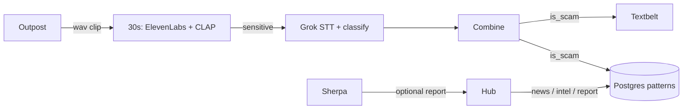

# Your Prince Is Not Real

**Stop the scam before it starts.**

[yourprinceisnotreal.net](https://yourprinceisnotreal.net) · HopHacks 2026

Scams have outgrown the “suspicious website” checker. Callers clone voices. Scripts impersonate banks, the IRS, or a grandson in trouble. After you pick up, you are on your own.

**YPINR** catches the interaction while it is still early, then files the *method* so the next person is not starting from zero. We are not carrier blocking. We do not claim zero false positives.

| Surface | Product | Job |
| --- | --- | --- |
| Phone / live audio | **Outpost** | Laptop sidecar. Clips the opening of a call and POSTs it to the detector. |
| Social / DMs | **Sherpa** | On-device Chrome extension. Highlights risky sentences in place. |
| After the fact | **Hub** | [yourprinceisnotreal.net](https://yourprinceisnotreal.net) — questionnaire, intel, news, report a pattern. |

---

## Outpost

Desktop sidecar (`desktop/`). One click starts a capture loop. Clips go to `POST /v1/process`; the window shows the latest verdict, not a log. Models do **not** run on the Mac.

The wav **does** leave the laptop (HTTP to the Linux detector). Outpost also writes temp clips under the save folder. Scoring is on ravens; an SMS can fire if Grok calls it a scam.

Details: [`desktop/README.md`](desktop/README.md)

## Sherpa

Chrome MV3 (`sherpa/`). No account, no upload, no telemetry for highlighting.

Weighted cues + association edges + family combos (urgency + payment, authority + credentials, secrecy + money). Bands: 0–24 nothing, 25–54 yellow **SUSPICIOUS**, 55–100 red **SCAM LIKELY**. Discord, Instagram, Reddit, Google Drive comments. Optional report to the hub is the method, not the person.

Details: [`sherpa/README.md`](sherpa/README.md) · scorer: [`sherpa/scam-smell/`](sherpa/scam-smell/README.md)

## Hub

React + Vite. GitHub Pages.

| Route | What it does |
| --- | --- |
| `/` | News wire + **Run check** |
| `/questionnaire` → `/results` | Adaptive questions; local rules rank likely types |
| `/scams` · `/scams/:id` | Intel from the detector catalog (TF-IDF search) |
| `/sherpa` | What the extension watches for |
| `/our-goal` | Privacy + **this happened to me** report |
| `/outpost` | In-browser capture demo (still needs a local detector) |

Share the method — gift cards, IRS refund, romance urgency. No names, numbers, or codes.

## Detector

Linux (`backend/detector`). Shared brain.

1. **Screen** first ~30s: ElevenLabs AI-voice + **CLAP** (`laion/clap-htsat-unfused`) vs `clap_phrases.json` → alarm + sensitivity.
2. **Escalate** only if sensitive: Grok Voice Transcribe → Grok 4 JSON (`is_scam`, type, confidence, method, target, reasoning).
3. **Ground labels:** TF-IDF retrieve top catalog rows and paste them into the Grok prompt (not pgvector).
4. **Act if scam:** upsert Postgres pattern (unique `name`, bump `frequency`) + Textbelt SMS. If not scam: no SMS.

SMS body is generic (`Warning: possible scam in progress. End the call.`) — Textbelt rejects URLs. Reasoning shows in Outpost / the hub, not in the text.

Postgres holds **pattern types**, not people (`backend/db`). Seeded public reports, **~132** merged types.

Optional Discord bot (`backend/discord_bot`) hits `POST /v1/analyze`. No SMS.



Default score after escalate: `0.4 * elevenlabs_ai_score + 0.6 * grok.confidence`.

| Combined | `notification_tier` |
| --- | ---: |
| ≥ 0.70 | high |
| ≥ 0.40 | medium |
| else | low |

---

## Privacy

- Sherpa highlighting never leaves the device.
- The corpus stores platforms, demands, victim *roles*, phrases — not names or account numbers.
- Outpost sends audio to the detector for that request; we do not keep a call archive in Postgres.
- Call-recording consent and SMS opt-in are real constraints.

---

## What this is not

- Not a replacement for carrier / OS spam blocking.
- Not a general anti-deepfake court. ElevenLabs is strongest on ElevenLabs-style voices in the opening window.
- Not a website checker. We score the conversation, then teach an encyclopedia.

---

## Repository map

```
desktop/              Outpost — Mac capture → POST /v1/process
sherpa/               Chrome extension + scam-smell scorer
frontend/             Hub — React / Vite
backend/detector/    Screen → Grok → ingest / notify
backend/db/          Postgres schema + seeds
backend/warnings/    Textbelt notifier
backend/discord_bot/ Optional /scamcheck
training_data/        Eval clips + detect_scam prompt
DECISIONS.md          Pipeline log
DEPLOY.md             Domain + tunnel
```

---

## Stack

| Layer | Choice |
| --- | --- |
| Hub | React 18 + Vite 5, GitHub Pages |
| Outpost | Python 3.11, Tk, sounddevice, PyInstaller |
| Sherpa | Manifest V3, on-device TypeScript scorer (esbuild) |
| STT | xAI `grok-voice-transcribe-2.0` |
| Classify | xAI `grok-4`, JSON object |
| AI voice | ElevenLabs speech classification |
| Phrases | CLAP `laion/clap-htsat-unfused` (Linux / CUDA) |
| Catalog retrieve | In-memory TF-IDF over seed TSV |
| SMS | Textbelt |
| DB | Postgres, SQLAlchemy, Alembic |

---

## Run it locally

**Hub**

```bash
cd frontend
npm install
npm run dev
# http://127.0.0.1:5173  — /api proxies to :8000
```

**Sherpa:** `chrome://extensions` → Developer mode → Load unpacked → **`sherpa/`** (folder with `manifest.json`).

**Detector** (Linux GPU box; CLAP/torch extra is not for the Mac)

```bash
cd backend/detector
uv python pin 3.11
uv sync --group dev --extra kws
# .env: XAI_API_KEY, ELEVENLABS_API_KEY, DATABASE_URL, TEXTBELT_KEY
uv run uvicorn app:app --host 127.0.0.1 --port 8000
```

**Outpost** (Mac; tunnel first)

```bash
ssh -N -L 8000:localhost:8000 hji@ravens
cd desktop
uv run --python 3.11 python app.py
```

Missing `TEXTBELT_KEY` builds SMS copy but does not send. Keys stay in gitignored `.env`.

---

## Prize tracks

| Track | Why |
| --- | --- |
| **ElevenLabs** | AI-voice score on the opening clip, gated into escalate / SMS. |
| **GoDaddy** | Public hub every product points at. |
| **Bloomberg Philanthropy** | Living pattern encyclopedia; mid-call protection, not an ad tool. |
| **Cursor** | Agents + slash routines (news wire, phrase refresh) around the detector. |

Inspired by [Have I Been Pwned](https://haveibeenpwned.com) and Akinator.

HopHacks 2026.
